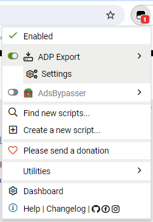

ADP Data Download
=================

This allows you to download your ADP Global MyView paystubs.

## Features

* Adds a button to bottom of Pay History to export CSV/JSON.
* Uses the already existing checkboxes to select which paystubs to download.
* Adds a "Toggle all" link to select all the paystubs for that year.
* Configuration GUI for configuring column mapping and other things.

## Installation

Click [here](https://github.com/kdar/adp-export/releases/latest/download/adp-export.user.js) in order to install it. Greasemonkey/Tampermonkey/whatever should detect it's a user script and prompt you to install.

## Updating

Userscripts are set up to automatically update. You can check for updates from within the Greasemonkey or Tampermonkey menu, or click on the install link again to get the update.

## Usage

Once the userscript is installed, navigate to the myPay page. At the bottom of the "Pay History" list, there will be an "Export" button. Click that and choose whatever option you like. If you choose to download or copy a CSV, it will prompt you if you are missing any column mappings and whether you want to import it into your configuration.

## Configuration

The userscript allows you to make certain JSON keys to CSV columns. This will vary based on the userscript runner you're using, but in TamperMonkey you can click the addon icon, go to ADP Export > Settings. 

There, you can configure what each JSON key gets mapped to. Don't worry if you don't know all the possible JSON keys that are available. The userscript will prompt you when you export a CSV and show what you're missing. You can then just go into the settings and change the column name to whatever you want.

The checkbox next to each mapping indicates whether to enable this column or not. If it's disabled, it will not output that column in the CSV. I recommend doing this instead of deleting a mapping, because the userscript will keep prompting you about a missing key/column.

