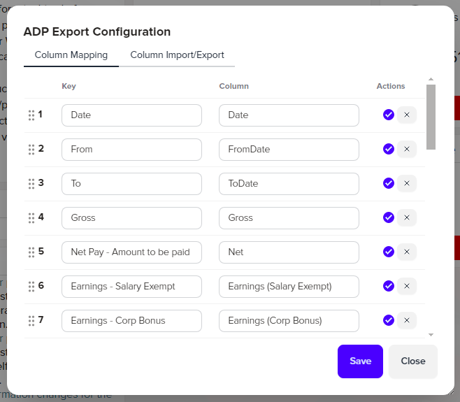
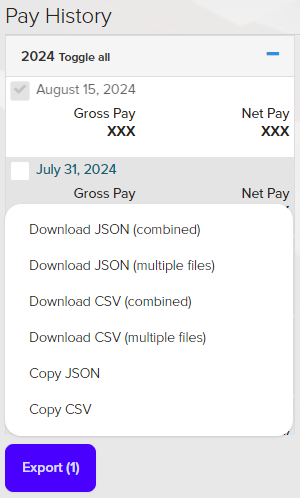

ADP Data Download
=================

This allows you to download your ADP Global MyView paystubs.

## Features

* Adds a button to bottom of paystub list to export CSV/JSON.
* Uses the already existing checkboxes to select which paystubs to download.
* Adds a "Toggle all" link to select all the paystubs for that year.
* Configuration GUI for configuring column mapping and other things.

## Installation

Click [here](https://github.com/kdar/adp-export/releases/latest/download/adp-export.user.js) in order to install it. Greasemonkey/Tampermonkey/whatever should detect it's a user script and prompt you to install.

## Updating

Userscripts are set up to automatically update. You can check for updates from within the Greasemonkey or Tampermonkey menu, or click on the install link again to get the update.
